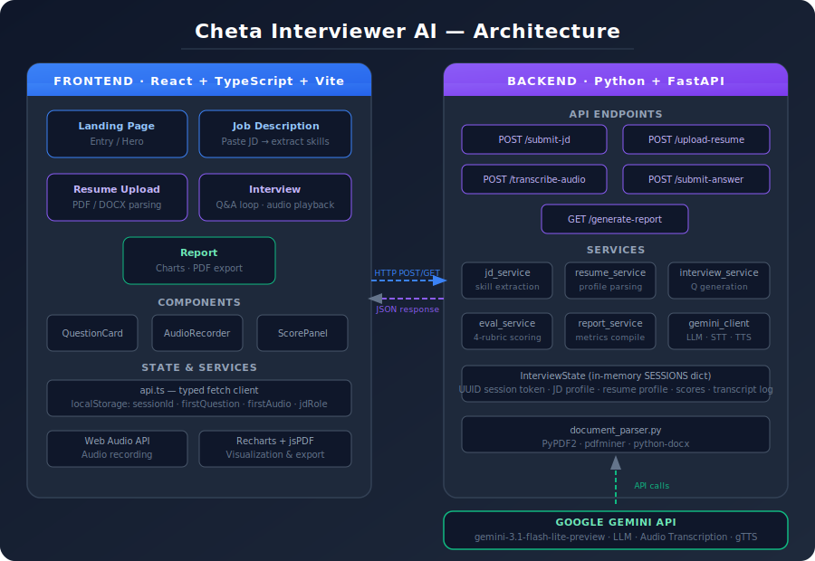

# Cheta Interviewer AI

A full-stack AI-powered mock interview platform that generates personalized technical interview questions from your resume and job description, evaluates your spoken answers in real time, and delivers a comprehensive performance report.

---

## Architecture



---

## Features

- **JD-Driven Questions** — Paste any job description and the system extracts required skills to build a targeted question set
- **Resume Parsing** — Upload PDF or DOCX; the AI cross-references your experience with the JD to tailor difficulty
- **Voice Answers** — Speak your answers; Gemini transcribes audio to text automatically
- **AI Evaluation** — Each answer is scored across four rubrics: Technical Accuracy, Depth, Clarity, and Confidence
- **Text-to-Speech Questions** — Questions are read aloud via gTTS for a realistic interview feel
- **Performance Report** — Radar and bar charts, per-skill breakdowns, strengths, improvements, and PDF export

---

## Tech Stack

| Layer | Technology |
|---|---|
| Frontend | React 18, TypeScript, Vite, Tailwind CSS |
| Backend | Python, FastAPI (async) |
| LLM | Google Gemini (`gemini-3.1-flash-lite-preview`) |
| Speech-to-Text | Gemini audio understanding |
| Text-to-Speech | gTTS |
| Charts | Recharts |
| PDF Export | jsPDF |

---

## Project Structure

```
AI-Mock-Interview-System/
├── backend/
│   ├── app.py                  # FastAPI entry point & all endpoints
│   ├── config.py               # Environment config & model settings
│   ├── models/
│   │   └── interview_state.py  # Session state class
│   ├── services/
│   │   ├── openai_client.py    # Gemini LLM, STT, TTS wrappers
│   │   ├── jd_service.py       # Job description analysis
│   │   ├── resume_service.py   # Resume parsing
│   │   ├── interview_service.py# Question generation
│   │   ├── evaluation_service.py# Answer scoring
│   │   └── report_service.py   # Final report compilation
│   └── utils/
│       └── document_parser.py  # PDF/DOCX text extraction
└── frontend/
    └── src/
        ├── pages/              # Landing, JD, Upload, Interview, Report
        ├── components/         # QuestionCard, AudioRecorder, ScorePanel
        └── services/api.ts     # Typed API client
```

---

## Getting Started

### Prerequisites

- Python 3.9+
- Node.js 16+
- Google Gemini API key — get one free at [aistudio.google.com](https://aistudio.google.com)

### Backend

```bash
cd backend
python3 -m venv venv
source venv/bin/activate
pip install -r requirements.txt
```

Create `backend/.env`:
```
GEMINI_API_KEY=your_api_key_here
```

Start the server:
```bash
python -m uvicorn app:app --reload
```

### Frontend

```bash
cd frontend
npm install
npm run dev
```

Open `http://localhost:5173` in your browser.

---

## How It Works

1. **Job Description** — Paste the JD; backend extracts role and required skills
2. **Resume Upload** — Upload PDF/DOCX; AI builds your candidate profile
3. **Interview** — Up to 12 adaptive questions, one skill at a time
   - Question is spoken aloud via TTS
   - Record your answer or type it
   - AI transcribes, evaluates, and generates the next question
4. **Report** — View overall score, per-skill radar chart, and export as PDF

---

## Use Cases

- **Job Seekers** — Practice role-specific interviews before the real thing
- **Career Coaches** — Use as an assessment tool to track candidate progress
- **Students** — Prepare for technical interviews with realistic AI-generated questions

---

## Author

**Shaikat**
